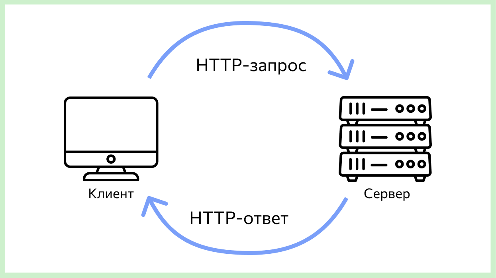

# Beginner hacker's toolkit

Сборник полезных отвёрток для семестровых проектов на Питоне у студентов первого курса 
направления ПАДИИ (анализ данных и машинное обучение) в Питерской Вышке.

# День 1, вторник, 7 февраля 2023

## Введение и пример проекта

Скорее всего, ваш проект будет состоять из HTTP-сервера или телеграм-бота, базы данных, использования API других сервисов.

Давайте разберём полезные инструменты на примере проекта телеграм-бота для хранения гардероба. Мы будем пользоваться ботом следующим образом:
- послать фотографию одежды
- просмотреть фотографии всей одежды

При этом при получении фотографии, бот должен удалить фон с фотографии и сделать его прозрачным, чтобы пользователь концентрировался только на одежде.

Далее мы разберём инструменты, нужные для реализации этого проекта.

## Телеграм-бот

https://thecode.media/python-bot/

Список других библиотек для телеграм-ботов (Ctrl+F Python). Скорее всего, вы 
пока не хотите разбираться с теми, где написано asynchronous.

https://core.telegram.org/bots/samples

## REST API и HTTP

Теперь мы хотим добавить в наше приложение удаление заднего фона с картинок.  Для этого можно воспользоваться сторонним сервисом. Давайте погуглим `remove background api`.  Я нашла [remove.bg](remove.bg).

- Описание для разработчиков
  - https://www.remove.bg/api#get-started

Сначала необходимо завести API ключ. Этот ключ - секрет между вами и сервисом. Ключ позволит сервису идентифицировать вас, то есть узнавать, что вы - это вы, каждый раз когда вы посылаете запрос. Идентификация нужна, чтобы подсчитывать квоту использования сервиса для каждого пользователя, например, не более 100 запросов в день.

Существуют и другие более сложные системы безопасности при работе с API. Внимательно читайте документацию к вашему сервису.

Далее давайте обратим внимания на примеры использования API, а именно, вкладки Curl и Python.

Curl - это консольная утилита (маленькая программа) для отправки, в частности, HTTP-запросов. Что такое  HTTP-запросы мы узнаем через минутку, но пока вы можете проверить, что этот сервис работает: вставьте этот код в ваш терминал, добавьте ваш API ключ и укажите правильный путь к файлу с картинкой.

```shell
$ curl -H 'X-API-Key: INSERT_YOUR_API_KEY_HERE'           \
       -F 'image_file=@/path/to/file.jpg'                 \
       -F 'size=auto'                                     \
       -f https://api.remove.bg/v1.0/removebg -o no-bg.png
```

А вот код на Питоне, который делает такой же HTTP-запрос к сервису, с помощью библиотеки для HTTP-запросов `requests`. Вы можете запустить этот код на Питоне и убедиться, что он тоже работает. Не забудьте поставить библиотеку: `pip install requests`.

```python
# Requires "requests" to be installed (see python-requests.org)
import requests

response = requests.post(
    'https://api.remove.bg/v1.0/removebg',
    files={'image_file': open('/path/to/file.jpg', 'rb')},
    data={'size': 'auto'},
    headers={'X-Api-Key': 'INSERT_YOUR_API_KEY_HERE'},
)
if response.status_code == requests.codes.ok:
    with open('no-bg.png', 'wb') as out:
        out.write(response.content)
else:
    print("Error:", response.status_code, response.text)
```

### HTTP

HTTP - это протокол общения двух компьютеров по сети. Компьютеры общаются путём посылки сообщений по сети, а протокол описывает какие сообщения и в каком порядке разрешено посылать.



HTTP уже много раз встречался в вашей жизни. Например, когда вы хотите зайти на сайт Вышки, вы вводите в браузере `https://www.hse.ru/` и ваш браузер создаёт HTTP-соединение с сервером (компьютером), на котором размещён сайт Вышки. Ваш браузер и сайт Вышки начинают обмениваться сообщениями вроде:
```
браузер: дай HTML главной страницы?
сайт: держи: "<html><title>Высшая Школа Экономики...</html>..."
браузер: ой, а ещё CSS-стили?
сайт: на: ...
браузер: и вот эту картинку? /logo.png
...
```

Всё это общение браузер делает незаметно от вас, вы лишь можете заметить, что какая-то картинка загрузилась позже, чем остальной сайт. Когда браузер получает HTML и CSS файлы от сервера, он отрисовывает картинку сайта для вас.

Общение по протоколу HTTP необязательно должно быть ассоциировано с отрисовкой, например, мы можем также запросить HTML страницу сайта Вышки через терминал, но не отрисовывать его. Воспользуемся curl:

```
curl -v https://www.hse.ru/en/ > /dev/null
```

В ответ получим информацию об общении нашего терминала с сервером сайта. Уберите `> /dev/null`, чтобы также увидеть сам ответ от сервера - HTML текст (очень много). Чтобы не заспамить ваш терминал, ещё подпишите ` | less` в конец строки. Тогда результат работы команды (`stdout`) перенаправится в консольный просмоторщик `less`, где можно полистать текст кнопками вверх, вниз, Page Up, Page Down и выйти из него клавишей `q`.

Чтобы сделать HTTP-запрос нужна следующая информация:
- адрес сервера
- тип запроса: GET, POST, etc.
- заголовок (header)
- тело запроса (body)

Содержание HTTP-ответа:
- Статус-код
  - 200 OK, 404 Not Found, etc.
  - https://en.wikipedia.org/wiki/List_of_HTTP_status_codes
  - https://http.cat/
- Заголовок
- Тело ответа

Давайте найдём все эти элементы на сниппете кода на requests выше.

```python
# Requires "requests" to be installed (see python-requests.org)
import requests

response = requests.post(
    'https://api.remove.bg/v1.0/removebg',
    files={'image_file': open('/path/to/file.jpg', 'rb')},
    data={'size': 'auto'},
    headers={'X-Api-Key': 'INSERT_YOUR_API_KEY_HERE'},
)
if response.status_code == requests.codes.ok:
    with open('no-bg.png', 'wb') as out:
        out.write(response.content)
else:
    print("Error:", response.status_code, response.text)
```

На всякий случай оставлю ссылки на документацию здесь:

https://requests.readthedocs.io/en/latest/api/#requests.request
https://requests.readthedocs.io/en/latest/api/#requests.Request
https://requests.readthedocs.io/en/latest/api/#requests.Response

Не перепутайте `requests.request` и `requests.Request`. Первое - это основной метод для посылки запросов, второе - класс-запрос.

Также заметьте, что для основного метода `requests.request` существует несколько альясов для вашего удобства, в зависимости от используемого метода (GET, POST): `requests.request('GET', ...)` эквивалентно `requests.get(...)` и т.д. Используйте документацию для основного метода, когда пользуетесь методом-альясом.

А вот сходу неплохой туториал по requests.

https://realpython.com/python-requests/

Вы можете заметить, что я местами сэкономила на правде и дала вам не совсем точное описание HTTP. Это потому что HTTP - очень запутанный протокол с несколькими не обратно совместимыми версиями. Это так не потому что он фундаментально сложный, а потому что он разрабатывается с 1991 года (> 30 лет) и постоянно переделывается под новые юзкейсы и исправляет непредвиденные баги. Впрочем, как и все протоколы и любой другой софт.

### Как сформировать запрос к API в Python
Допустим, вы хотите использовать апи для погоды [weatherstack.com](https://weatherstack.com/), но в документации апи нет примера, как вызвать апи через Питон, как это было в предыдущем апи. Апи погоды предоставляют следующий пример:
```
http://api.weatherstack.com/current
    ? access_key = YOUR_ACCESS_KEY
    & query = New York
```

Когда все **параметры** для запроса указаны через `?` после адреса апи-сервиса (API endpoint) и перечисленны в формате `?key=value&fruit=apple&city=dublin`, это GET запрос.

Давайте откроем документацию библиотеки `requests` и посмотрим, как делать get запрос.

https://requests.readthedocs.io/en/latest/api/#requests.request

Это очень длинная страница, давайте сразу найдём нужный нам кусок: Ctrl+F get:

```
requests.get(url, params=None, **kwargs)
Sends a GET request.

Parameters
url – URL for the new Request object.
params – (optional) Dictionary, list of tuples or bytes
         to send in the query string for the Request.
**kwargs – Optional arguments that request takes.
```

У метода `get` есть два основных параметра: `url`, в который мы передадим адрес API до знака вопроса - `http://api.weatherstack.com/current`, и параметр `params`, куда можно передать словарь, который добавится к строке запроса. Итого наш запрос будет выглядеть следующим образом:

`requests.get('http://api.weatherstack.com/current', params={'key': 'value'})`

Подставьте правильные параметры в качестве упражнения.

# День 2, вторник, 14 февраля 2023

### Postman
Веб-интерфейс, который позволяет вам посылать HTTP-запросы, чтобы потестировать API.

Демонстрация использования API для погоды [weatherstack.com](https://weatherstack.com/) через Постман.

## JSON
Вскользь упоминаем уже второе занятие, но формального определения ещё не было.

## Советы по Питону

- Полезные встроенные функции: `type(объект)`, `dir(объект)`, `vars(объект)`
- Дебаг с помощью PyCharm
  - расстановка breakpoint
  - шагание по строчкам
  - вычисление значения
- Дебаг с помощью `import pdb; pdb.set_trace()`
- ipython
- PyCharm
  - Самый главный шорткат: `Ctrl + Shift + A` - поиск по всем шорткатам, например попробуйте:
    - increase font
    - enter presentation mode
    - reformat file

## Вопросы-ответы:
- что такое базы данных
  - текстовый файл - это простейшая база данных
  - json файл, если нужно 
  - CSV
- как сделать клиент-сервер для игры
  - grpc, ngrok
- как сделать расширение для хрома, которое переводит слова, если хочется хранить статистику какие пользователи переводят какие слова
  - расширение для хрома будет на JavaScript дёргать ваш сервис с запросом `"юзер 4323 запросил слово incomprehensible"`в виде http-запроса
  - вы пишите свой http-сервер на python flask
  - в хендлере запросов `(user_id, word)` вы
    - сохраняете слово и пользователя в базу данных
    - делаете запрос к переводчику и возвращаете http-ответ с переводом


# День 3, вторник, 21 февраля 2023
## Упражнение на JSON
- Скопировать json отсюда в многострочную строку в питоне (в трёх кавычках): https://en.wikipedia.org/wiki/JSON#Syntax
- Импортировать библиотеку json `import json`, применить функцию парсинга json-строки в Питоновский словарь: `json.loads(json_string)`.
- Напечатать офисный номер телефона (`"646 555-4567"`) используя только оператор квадратные скобки у словарей и списков: `[]` у полученного выше словаря.


## SQL и базы данных
Базовый синтаксис SQL, SQLite, драйвер для языка программирования.

SQL https://w3schools.com/sql


SQLite для Питона https://docs.python.org/3/library/sqlite3.html


## CSV, text


# В следующих сериях

## Советы по Питону 2

- Читайте официальную документацию 
- PEP8
- black
- logger
  - https://docs.python.org/3/howto/logging.html
  - Как сконфигурировать: https://stackoverflow.com/a/56144390/3478131
- tqdm
- platform-specific code, e.g. `os.path.join`
- splitting into files, classes, functions
- types, static/dynamic type checkers, mypy

### Сервисы, предоставляющие API
- Список бесплатных апи для вдохновения
  - https://github.com/public-apis/public-apis
- Осторожно с теми апи, которые дают бесплатный доступ только на X дней.
- Некоторым компаниям можно писать и просить учебный доступ к их платному API. Например, у меня с 2ГИС сработало (1000 запросов на 3 месяца).
- Конкретные примеры
  - Удаление фона - [remove.bg](remove.bg) - 50 картинок / месяц
  - Погода - [weatherstack.com](https://weatherstack.com/) - 250 запросов / месяц

### Не сервисы, но тоже полезно
Например, после того как мы удалили фон, мы хотим добавить к каждому предмету одежды новый красивый фон, например, градиент.

То есть нам нужен софт, который может:
- сгенерировать фон-градиент
- наложить картинку и фон

Можно найти сторонний сервис, который умеет этот делать, и использовать его через API. Однако может быть проще делать это локально с помощью какой-нибудь библиотеки для Python или программы, которую можно будет вызывать через Python. Например, `imagemagick` или `OpenCV`.


## HTTP-сервер
- flask
- не используйте python httpserver - будет очень больно


## Чук и Гек, точнее, гит и Гитхаб
- Создание и подключение SSH ключа: https://docs.github.com/en/authentication/connecting-to-github-with-ssh/generating-a-new-ssh-key-and-adding-it-to-the-ssh-agent

- Используйте приватный email. https://github.com/settings/emails, должна стоять галочка Keep my email address private.
Там же будет ваш приватный емейл вида `[your-github-handle]@users.noreply.github.com`.

- Как коммитить из терминала.
- Гит и Гитхаб в PyCharm.
- Как не слить свои API токены всему миру: переменные окружения (environment variables).

## Развёртывание в облако
ngrok, pythonanywhere, Яндекс.Облако

## Ещё
- вебхуки

# Для анализа данных

## Jupyter Notebook
- Артефакты проделанной работы при анализе данных - ноутбук с подробными Markdown комментариями.

## Numpy + Pandas 
- https://www.kaggle.com/learn/pandas
- См. также другие курсы https://www.kaggle.com/learn

## Data scrapping
- Python requests
- Beautiful soup - парсинг HTML
- Чистка данных (хехе, не знаю, что расказывать)
- Ручная разметка данных, Толока
- Какие ML методы и задачи существуют, и что к чему применять:
  - https://vas3k.blog/blog/machine_learning/

## Датасеты
https://www.kaggle.com/datasets

## Графики, визуализация данных
- Matplotlib https://matplotlib.org/stable/tutorials/introductory/pyplot.html
- Seaborn https://www.kaggle.com/learn/data-visualization


